# 🎓 Educational Interview Preparation App with Agentic AI

## 📌 Intro Description
**Educational Interview Preparation App with Agentic AI** is a **voice-interactive tool** that helps users practice job interviews in real time. Unlike static platforms, it **simulates realistic conversations**, evaluates answers, and provides **personalized feedback**.

By combining **AI-driven agents, speech-to-text, and text-to-speech**, the app adapts to each user’s skill level, tracks progress, and offers tips to improve **clarity, tone, and relevance**.  
It’s designed to make **interview preparation accessible, effective, and engaging** for everyone.

---

## 🗂️ Scheme

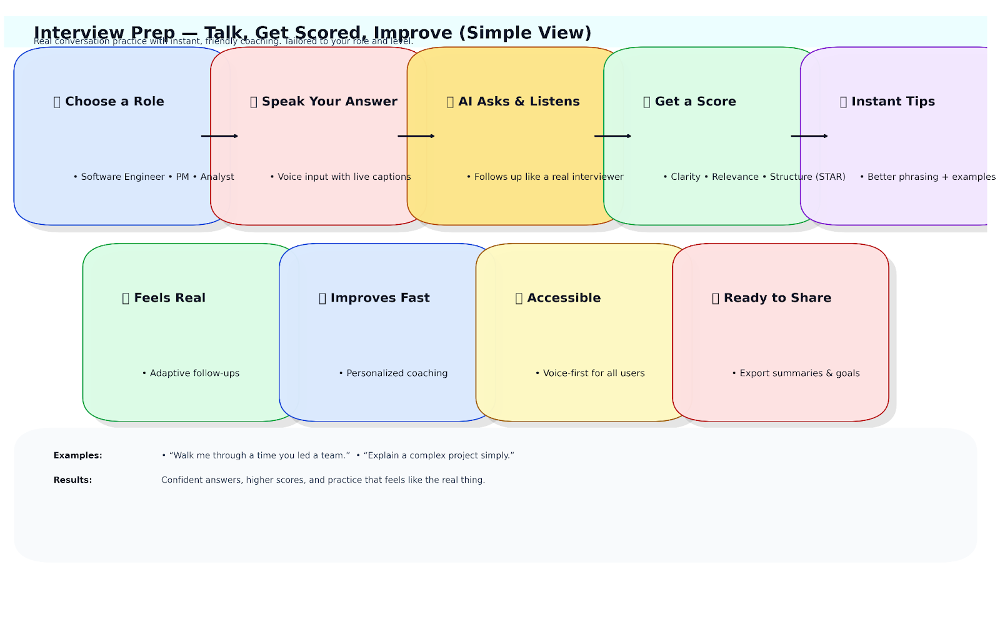

---

## 🧩 Examples

<table>
    <tbody>
        <tr>
            <td width="50%">
                
            </td>
            <td width="50%">
                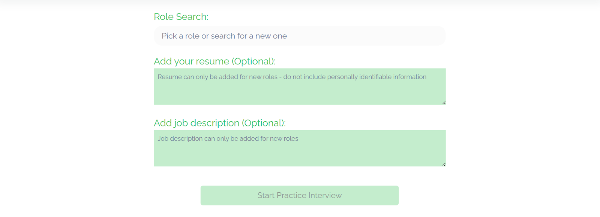
            </td>
        </tr>
        <tr>
            <td width="50%">
                
            </td>
            <td width="50%">
                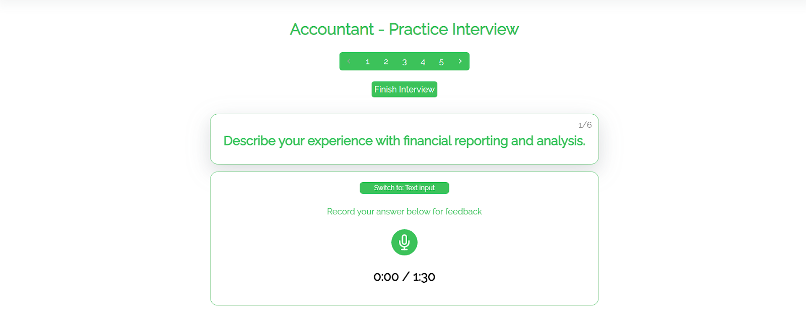
            </td>
        </tr>
        <tr>
            <td width="50%">
                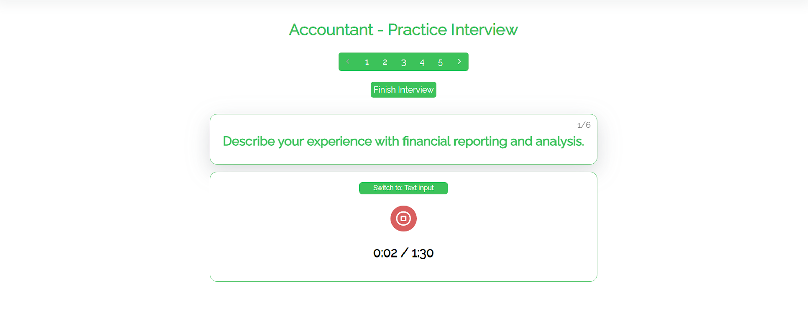
            </td>
            <td width="50%">
                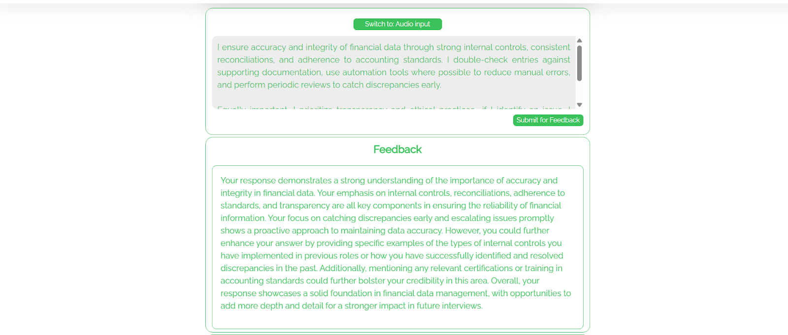
            </td>
        </tr>
        <tr>
            <td width="50%">
                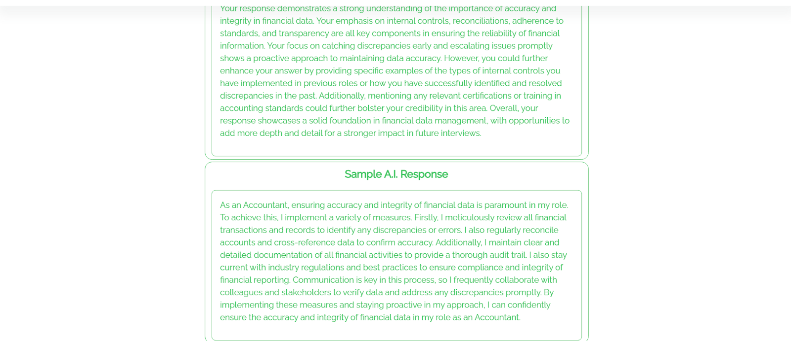
            </td>
            <td width="50%">
                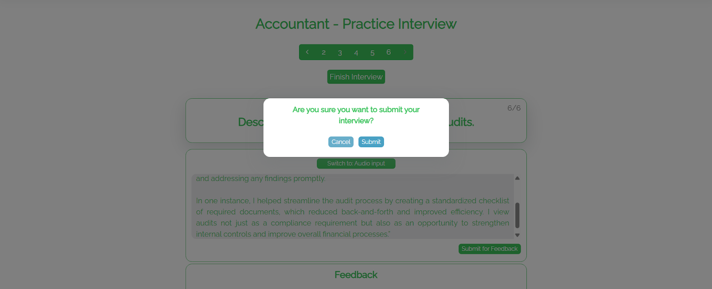
            </td>
        </tr>
        <tr>
            <td width="50%">
                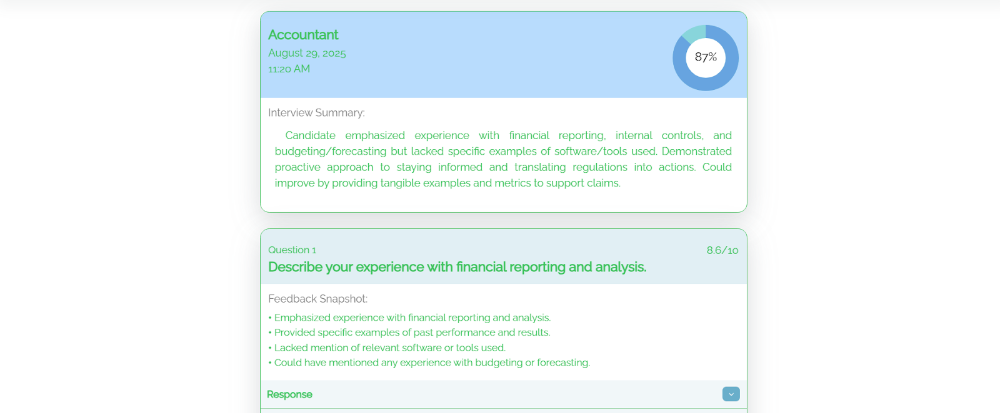
            </td>
            <td width="50%">
                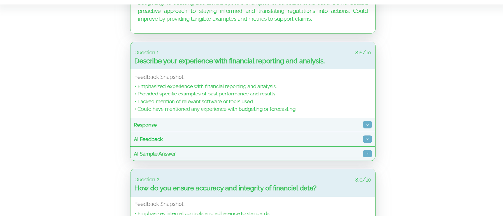
            </td>
        </tr>
        <tr>
            <td width="50%">
                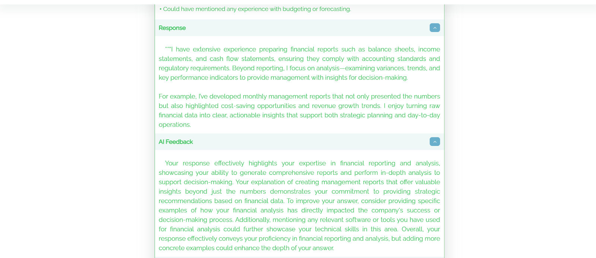
            </td>
            <td width="50%">
                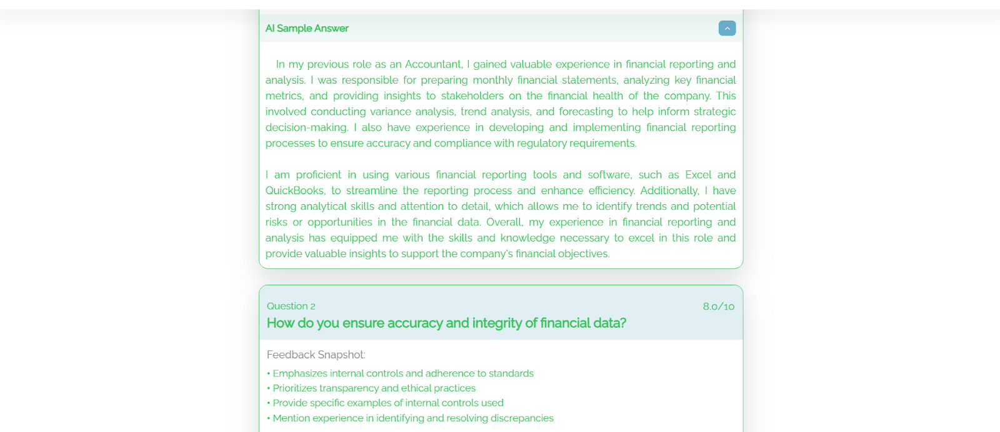
            </td>
        </tr>
        <tr>
            <td width="50%">
                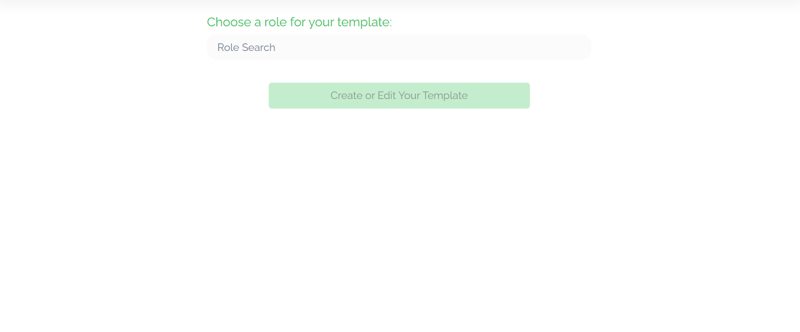
            </td>
            <td width="50%">
                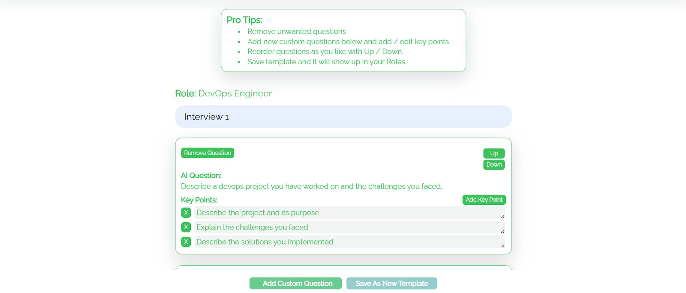
            </td>
        </tr>
    </tbody>
</table>

## 🎥 Video Examples

<table>
    <tbody>
        <tr>
            <td width="50%">
                <video src="https://github.com/user-attachments/assets/ef85530d-d7fa-4320-b03d-25aef95d6280" controls preload>
                    Your browser does not support the video tag.
                </video>
            </td>
            <td width="50%">
                <video src="https://github.com/user-attachments/assets/3e9f68cc-53bc-46fe-b2b2-24c389ccdc78" controls preload>
                    Your browser does not support the video tag.
                </video>
            </td>
        </tr>
        <tr>
            <td width="50%">
                <video src="https://github.com/user-attachments/assets/f13792fb-bdd5-40bc-bce0-7b9d7df3ebec" controls preload>
                    Your browser does not support the video tag.
                </video>
            </td>
            <td width="50%">
                <video src="https://github.com/user-attachments/assets/f635c8e7-8d74-4ccf-98b7-8a83192fc96c" controls preload>
                    Your browser does not support the video tag.
                </video>
            </td>
        </tr>
    </tbody>
</table>

<table>
    <tbody>
        <tr>
            <td width="50%">
                <video src="https://github.com/user-attachments/assets/a785cf9c-bb04-4312-a920-e22e8639301f" controls preload>
                    Your browser does not support the video tag.
                </video>
            </td>
            <td width="50%">
                <video src="https://github.com/user-attachments/assets/9991ba9b-722c-468b-8b5a-1eafbb159cdd" controls preload>
                    Your browser does not support the video tag.
                </video>
            </td>
        </tr>
        <tr>
            <td width="50%">
                <video src="https://github.com/user-attachments/assets/facad24b-fe01-4531-b36b-780be2289672" controls preload>
                    Your browser does not support the video tag.
                </video>
            </td>
            <td width="50%"></td>
        </tr>
    </tbody>
</table>

<table>
    <tbody>
        <tr>
            <td width="50%">
                <video src="https://github.com/user-attachments/assets/fad59afa-43e5-4156-85af-5c71ef642775" controls preload>
                    Your browser does not support the video tag.
                </video>
            </td>
            <td width="50%">
                <video src="https://github.com/user-attachments/assets/98614e63-285a-4964-8eab-734e0283fd21" controls preload>
                    Your browser does not support the video tag.
                </video>
            </td>
        </tr>
        <tr>
            <td width="50%">
                <video src="https://github.com/user-attachments/assets/47b86ee1-b869-4670-b62d-49041be03c10" controls preload>
                    Your browser does not support the video tag.
                </video>
            </td>
            <td width="50%">
                <video src="https://github.com/user-attachments/assets/dc4b2841-af0f-4a90-a648-29f8a1f45378" controls preload>
                    Your browser does not support the video tag.
                </video>
            </td>
        </tr>
        <tr>
            <td width="50%">
                <video src="https://github.com/user-attachments/assets/b5b3dcc8-1016-45a5-a42d-e2786a69d287" controls preload>
                    Your browser does not support the video tag.
                </video>
            </td>
            <td width="50%"></td>
        </tr>
    </tbody>
</table>

---

## 📊 Full Description

  
📖 Click to expand the Description

### 🛠 Problem Solved
Preparing for interviews often requires:
- ✅ Personalized practice
- ✅ Real-time feedback
- ✅ Realistic simulation

Traditional platforms fail to adapt, offering **static scripts** or **rigid Q&A**.  
This app solves the gap by providing **intelligent, voice-driven interview training** with **adaptive coaching**.

---

### 🚀 Solution & Achievements
- 🧠 **Agentic AI architecture**: Modular interview agents (questioning, feedback, hints).
- 🎤 **Full voice interaction**: Google STT/TTS + WebRTC for real-time conversations.
- 📊 **Feedback evaluation**: Assess clarity, relevance, and tone.
- 📚 **Progress tracking**: PostgreSQL memory system for personalized learning.
- 🤖 **Adaptive difficulty**: AI interviewer adjusts questions based on performance.

---

### 🔑 Key Achievements
- Built modular **LangChain + Mistral** agents for interview flow.
- Enabled **low-latency voice sessions** via WebRTC.
- Developed **feedback agents** for real-time scoring & tips.
- Integrated **context-aware memory** for personalized learning history.
- Supported **adaptive interview scenarios** (tech, HR, behavioral, etc.).

---

### 🧩 Training & System Highlights
- **Agentic AI Structure**: Specialized agents for questioning, evaluation, hints, and follow-ups.
- **Voice Interaction**: Google STT/TTS APIs + WebRTC for smooth speech-driven dialogue.
- **Feedback Loop**: Responses analyzed

